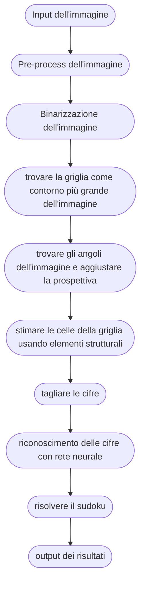
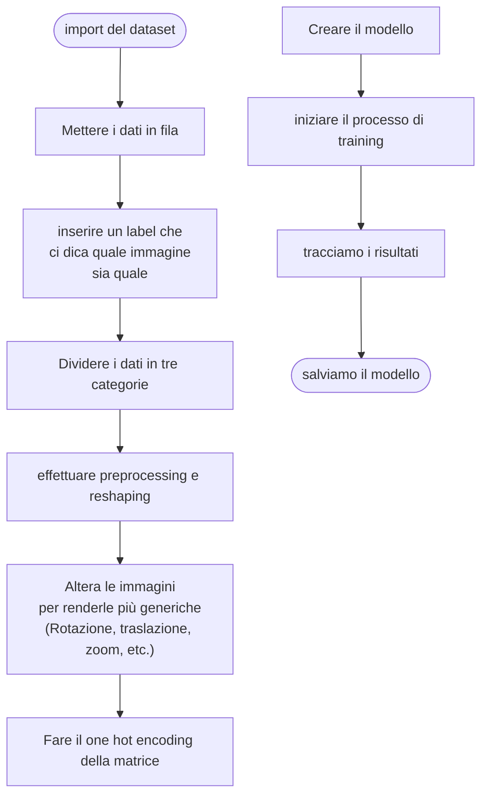
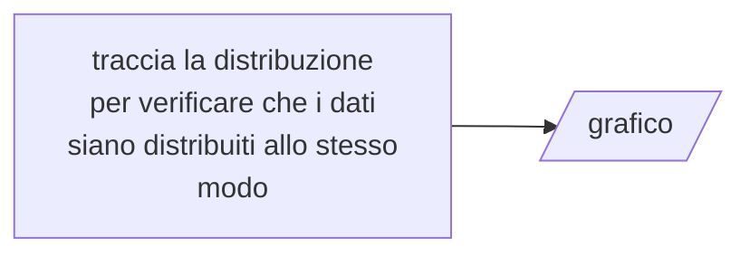
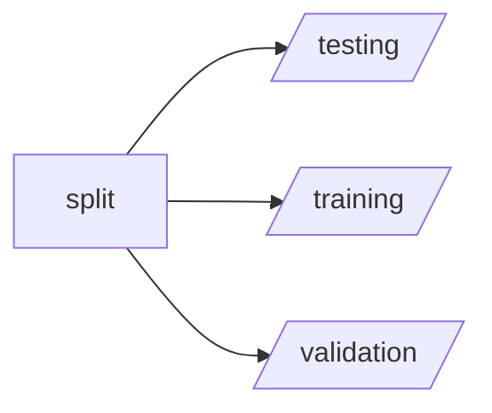

# Roadmap

```mermaid
graph TD;
    in([Input dell'immagine])
        --> pre([Pre-process dell'immagine])
        --> bin([Binarizzazione dell'immagine])
        --> grid([trovare la griglia come contorno più grande dell'immagine])
        --> angoli([trovare gli angoli dell'immagine e aggiustare la prospettiva])
        --> stima([stimare le celle della griglia usando elementi strutturali])
        --> crop([tagliare le cifre])
        --> cifre([riconoscimento delle cifre con rete neurale])
        --> risolvi([risolvere il sudoku])
        --> out([output dei risultati])
```

## Text detection using Neural Networks

```mermaid
graph TD;
    input([import del dataset])
        --> list[Mettere i dati in fila]
        --> label[inserire un label che<br>ci dica quale immagine<br>sia quale]
        --> split[Dividere i dati in tre categorie]
        --> pre_res[effettuare preprocessing e reshaping]
        --> augment["Altera le immagini<br>per renderle più generiche<br>(Rotazione, traslazione, zoom, etc.)"]
        --> onehot[Fare il one hot encoding della matrice]

    model[Creare il modello]
        --> train[iniziare il processo di training]
        --> plot[tracciamo i risultati]
        --> save([salviamo il modello])
```

## Plot

```mermaid
graph LR;
    plot[traccia la distribuzione<br>per verificare che i dati<br>siano distribuiti allo stesso<br>modo]
        --> data_plot[/grafico/]
```

## How to split

```mermaid
graph LR;
    split --> t[/testing/] & tt[/training/] & v[/validation/]
```
